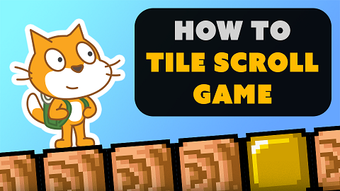

# Pygame TileScrollingPlatformer

A pygame implementation of the scratch
[ Tile Scrolling Platformer](https://www.youtube.com/watch?v=Fl-LX94Z4Cc&list=PLy4zsTUHwGJIc90UaTKd-wpIH12FCSoLh)
tutorial series from
[griffpatch](https://www.youtube.com/channel/UCawsI_mlmPA7Cfld-qZhBQA).



- [Original scratch project](https://scratch.mit.edu/projects/485855713/)
- [Griffpatch's Github](https://github.com/griffpatch)

## The Why

Implementing this tutorial in python bring some interesting insights.

1 - The scratch system covers a lot of the underlying functionalities that
pygame will not have by default. Pygame does offer a bridge to the sdl2
development library, but not a scratch like custom management or neither their
sprite system. Some scratch bricks such as the `not` can be directly translated
into python without any trouble, however a lot of them actually needs complete
rethinking, for instance `when ... pressed`, or harder `create clone`
, `broadcast` and more...

2 - Some algorithms have been thought within scratch system which brings the
question of their usage in a python implementation, leading to an interesting
part of adaption from the Original project. As an example, if the costumes
within scratch is something no one would even try changing, with pygame, loading
lot of tiny sprite isn't a good approach, and it could - **will** - be replaced
with something as spreadsheet.

3 - Scratch have its own online ecosystem, and even throughout the amelioration
its has received, is still subject to hard limitation (global 300 clone limit,
fixed 4/3 screen size, low fps limit, etc...). Without these limitations, the
doors open to a new dimension of possibilities.

4 - Griffpatch tutorial is really well-made and explained, and this pygame
implementation project will allow me to learn a lot about some game mechanics,
which will be useful for future games.

## The How

For every episode of the series, a release will be created that includes an
executable (window 10 x64, you can still try with other Windows version or with
a program such as wine, but it will not be guaranteed to work at all).

This will come along as a todo-like project with the feature of the episode that
will help to organize the project.

As Explicit said, this is a rewrite in the Python Programing language. For more
precision tho, it will be written for the version 3.8.6 +, fully typed (typing
library), and following pep8 guidelines. To know about installed packages and
version, you can check the requirements.txt file.

*contributions are welcome !*

## The when

This project might take a lot of times and progress slowly as this is far from
begin my main current project. however, todo-projects will be set, release made,
And you can watch the repo to stay tune about the updates !

## Install (for devs)

*Makes sure to have the right python version first !*

1 - download the files from the repository 
```git
git clone https://github.com/Sigmanificient/Pygame-TileScrollingPlatformer
```

2 - Install the required packages in your python intepreter or venv
```py
python -m pip install requirements.txt
```

3 - Runs the `main.py` module.
```py
python -m main.py
```

### Building as an executable
1 - Install the required packages in your python intepreter or venv
```py
python -m pip install requirements-build.txt
```

2 - Use the pyinstaller cli to build it 
```py
pyinstaller -w --onefile main.py
```

You'll get the executable from the `/dist` folder but it order to works,
you'll need to add the assets folder aside of it.

<hr>
*Huge thanks to Griffpatch for this amazing series and his works !*